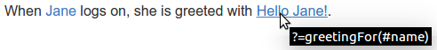
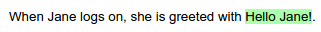

# Markdown
_Since_: Concordion 2.0.0

## Philosophy

[Markdown](https://daringfireball.net/projects/markdown/) provides an easy-to-read and easy-to-write syntax for converting plain text to structured XHTML.

Concordion's Markdown support allows you to write your [Concordion](http://concordion.org/) specification in the Markdown format, converting the Markdown to XHTML at runtime and running the resultant XHTML as a Concordion specification. 

The following assumes that you already understand Concordion and Markdown. If not, please visit the [Concordion tutorial](http://concordion.org/Tutorial.html) and read the Markdown [basics](https://daringfireball.net/projects/markdown/basics). 

### Use of inline links 

Markdown links are used to embed Concordion commands. This keeps the grammar readable and maintains a clean separation of Concordion commands from the original text.  

As an example:

> `When Jane logs on, she is greeted with Hello Jane!`

is marked up as:

> `When [Jane](- "#name") logs on, she is greeted with [Hello Jane!](- "?=greetingFor(#name)")`
 
where:

 * `[Jane](- '#name')` sets the `#name` variable to `Jane`.
 * `[Hello Jane!](- '?=greetingFor(#name)')` asserts that the `greetingFor(#name)` method returns `Hello Jane!`

When viewed on Github or in the preview pane of a Markdown editor, the original text is displayed as a link, and the Concordion command shown when you hover over the link:

> 

When the specification is run with a fixture that implements the `greetingFor(String)` method, the links are converted to spans and the output is marked up to show whether the assertion is passing or failing:

> 

## Basic Grammar

Concordion commands are differentiated from other Markdown [links](https://daringfireball.net/projects/markdown/syntax#link) by using the value `-` for the URL:

    [value](- "command")

As an alternative to inline links, reference style links are supported, for example:

    [value][id]
    
    [id]: - "command"

or

    [value][]
    
    [value]: - "command"

Reference style links can help improve readability of the Markdown document, especially for table headers or lengthy commands. 

### Commands
A shorthand syntax is provided for the set, assert equals and execute commands.

| Command        | Grammar                   | Example |
| -------------- | ------------------------  | ------- |
| Set            | `[value](- "#varname")`   | `[Jane](- "#name")` |
| Assert Equals  | `[value](- "?=#varname")` | `[Hello Jane!]` `(- "?=#greeting")` |
| Execute        | `[value](- "expression")` | `[The greeting is]` `(- "#greeting=greetingFor(#name)")` |
| Other commands | `[value](- "c:command")`  | `[is notified]` `(- "c:assertTrue=isNotified()")` |

#### Table Commands
The Github Flavored Markdown [tables](https://help.github.com/articles/github-flavored-markdown/#tables) syntax is used.

The command to be run on the table is specified in the first table header column, followed by the command for that column (if any), with the commands for each column of the table specified in the table header.

##### Execute on a table
The execute command is specified in the first table header column, followed by the command for that column (if any), with the commands for each column of the table specified in the relevant table header column.

    |[_add_](- "#z=add(#x, #y)")[Number 1](- "#x")|[Number 2](- "#y")|[Result](- "?=#z")|
    | ------------------------------------------: | ---------------: | ---------------: |
    |                                            1|                 0|                 1|
    |                                            1|                -3|                -2|

Reference-style links can be used for one or more of the links to improve readability of the Markdown source: 

    |[_add_][][Number 1](- "#x")|[Number 2](- "#y")|[Result](- "?=#z")|
    | ------------------------: | ---------------: | ---------------: |
    |                          1|                 0|                 1|
    |                          1|                -3|                -2|

    [_add_]: - "#z=add(#x, #y)"

##### Verify Rows
The verifyRows command is specified in the first table header column, followed by the command for that column (if any), with the commands for each column of the table specified in the relevant table header column.

    |[_check GST_][][Sub Total][]|[GST][]|
    | -------------------------- | ----: |
    |                         100|     15|
    |                          20|      2|

    [_check GST_]: - "c:verifyRows=#detail:getInvoiceDetails()"
    [Sub Total]:   - "?=#detail.subTotal"
    [GST]:         - "?=#detail.gst"

Note that reference-style links have been used to improve the readability of this example. Inline links are equally valid. 

#### Example Command
Concordion 2.0 introduces a new [example command](http://concordion.github.io/concordion/latest/spec/command/example/Examples.html).

Adding an inline link to a header changes the header into an example command. You can use either the Atx-style or Setext-style headers. For example:

    ## [Example 1](- "exampleName")

or 

    [Example 1](- "exampleName")
    ----------------------------------

will create an example named `exampleName` with the H2 heading `Example 1`.

If the example name is not specified, it will be generated from the heading title. For example:

    # [Check 3 items](-)

will create an example named `check-3-items` with the H1 heading `Check 3 items`.

##### Closing an example
The example block continues until it is closed either implicitly or explicitly.

An example is implicitly closed on any of these conditions:

* another example starts, or
* a header is encountered that is at a higher level than the example header (eg. the example is a `h3` and a `h2` header is encountered), or
* the end of file is reached.

To explicitly close an example, create a header with the example heading struck-through. For example:  

    ## ~~Example 1~~
    
will close the example with the heading `Example 1`    

__Note:__ the example command requires Concordion 2.0.0 or later.

#### Run Command
Adding a title of `c:run` to an inline link will add a run command to that link. For example:

    [Address](Address.html "c:run")

will run the `Address.html` specification.

---

### Further details
See the [Grammar Specification](MarkdownGrammar.md "c:run") for the full Grammar.

## Configuration
The extension can also be [configured](../../annotation/ConcordionOptions.md "c:run") to output the source HTML that is generated, and to add extensions to the Markdown language.

## Editor Support
### IDEA
The official IntelliJ IDEA Markdown editor is not recommended since it does not support tables. 
Instead, the [Markdown](https://plugins.jetbrains.com/plugin?id=5970) plugin is recommended. 
This plugin uses the same underlying Pegdown library as the Concordion Markdown extension. 
After installing the plugin, you will need to configure the [settings](https://plugins.jetbrains.com/files/5970/screenshot_14568.png) to enable Tables and Strikethrough, 
plus any additional Markdown language extensions that you [configure](../../annotations/ConcordionOptions.html).

### Eclipse
Available Eclipse plugins include:

| Plugin | Has editor? | Has viewer? | Viewer supports tables and strikethrough |
|--------|:-----------:|:-----------:|:----------------------------------------:|
|Mylyn Wikitext Editor| Y | Y | N |
|[Markdown Text Editor](https://marketplace.eclipse.org/content/markdown-text-editor)| Y | N | N |
|[Github Flavored Markdown Viewer](https://marketplace.eclipse.org/content/github-flavored-markdown-viewer-plugin)| N | Y | Y |

In order to have editing features and the ability to view with tables and strikethrough, you may want to install either of the first 2 editor plugins listed along with the viewer plugin.

### Github 
The syntax used for this extension is compatible with Github Flavored Markdown, allowing specifications to be edited and previewed in the Github editor.

_Please let us know what editor you are using, and what support you get from it. Either edit this page and raise a pull request or create an issue on this project to let us know. Thanks :)_

## Further details

* [What is the full grammar?](MarkdownGrammar.md "c:run")
* [How do I configure it to output the HTML or extend the Markdown syntax?](../../annotation/ConcordionOptions.md "c:run")